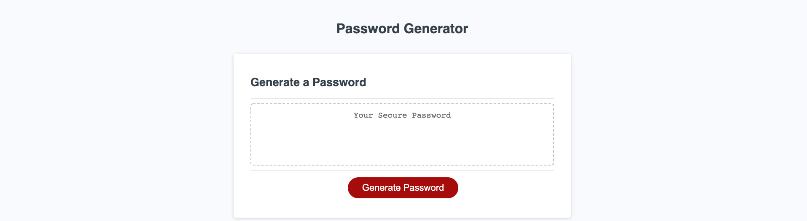
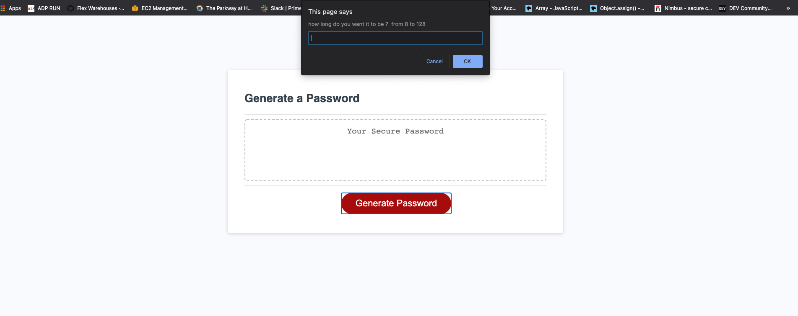
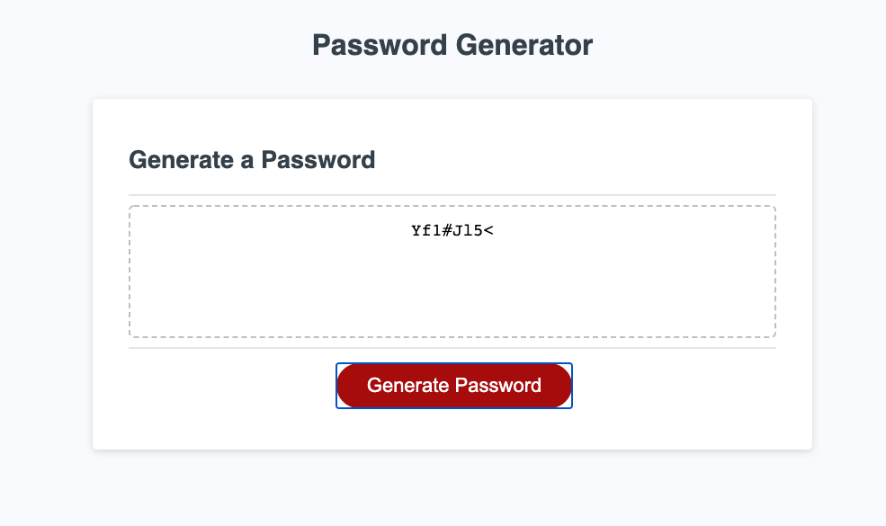

# homeWork_3

## My Respository
this is the repo where all the magic is happening for the password generator.
### created by Javier Perez
On this homeWork we are generating a random password, asking our user what to take in consideration: 
* UpperCase 
* LowerCase
* Numbers
* symbols
## Files
contains an index.html file with the structure of my app, a style.css giving the styling to my app and we have a script.js generating a random 
password.

## APP

## options: it would ask you what you want to include and how many characters you want through prompts

 ## Result
 

